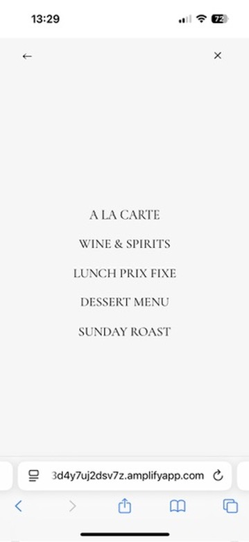
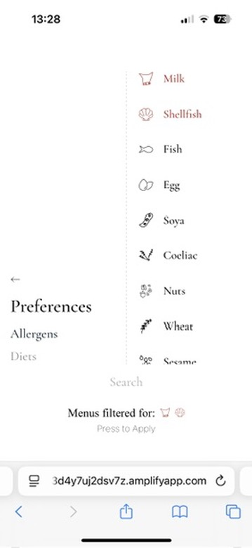
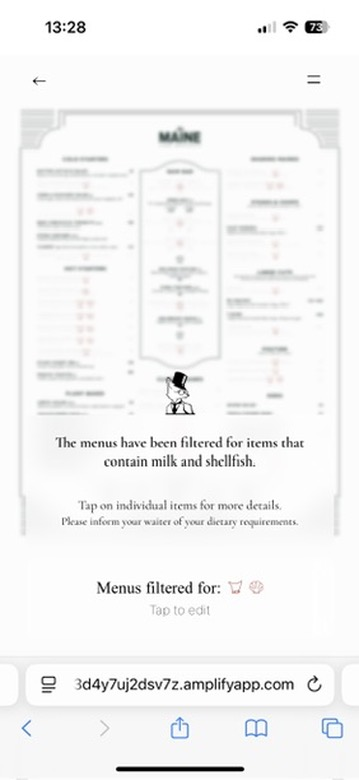
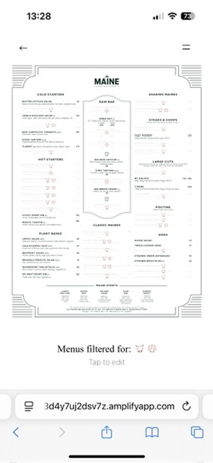
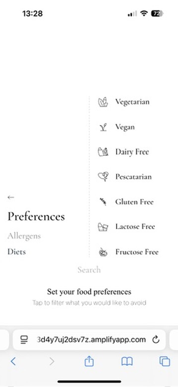
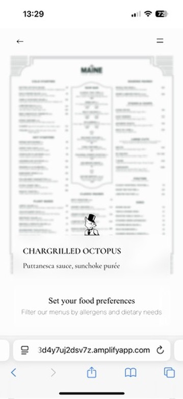
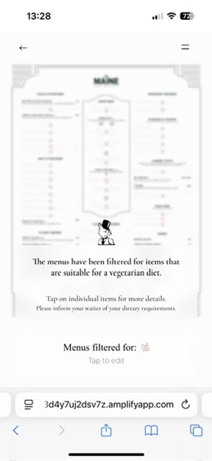

# Apollo Guide

**Independent Project – Apollo Guide (Jan – June 2024)**

Conceptualised and developed a full-stack platform to digitise restaurant menus with allergen- and dietary-restriction-aware filtering. Designed the data model, front-end, and backend architecture, integrating a React TypeScript frontend with an Express API and MySQL database, all deployed in AWS cloud infrastructure.

---

## Overview

Apollo Guide is a digital platform that transforms the dining experience for individuals with allergies, intolerances, or dietary preferences.

It allows diners to scan a QR code at partner restaurants and instantly view menus filtered by allergens, diets, or ingredients — creating a safer, more transparent, and inclusive dining experience.

For restaurants, Apollo Guide provides a modern and efficient system to manage, verify, and present allergen and dietary data accurately, improving both customer trust and operational efficiency.

> *The Right Choice Made Simple.*
> 

---

## Vision and Purpose

**Vision:**

To pioneer a future of seamless dining experiences.

**Mission:**

To create sophisticated technology that empowers people to simply and confidently make the right choices.

**Why:** To remove barriers between people and the joy of dining.

**How:** Through expert-driven validation, accurate data, and clear menu communication.

**What:** A digital platform that connects restaurants and diners through transparent, allergen-aware menus.

---

## Repository Structure

This monorepo contains three core applications, each representing a component of the Apollo Guide ecosystem.

```
apps/
├── backend/       # Express.js REST API for restaurant, menu, and ingredient data
├── frontend/      # React web app for diners to browse and filter menus
└── screening/     # Internal screening tool for managing allergen/dietary data
docs/              # Technical and conceptual documentation
```

---

## Applications

### **Backend**

The backend is a **Node.js/Express REST API** that powers the restaurant menu management system with dietary filtering capabilities.

It uses **MySQL** to store restaurants, menus, dishes, ingredients, and their relationships to allergens and diets.

Core functionality includes dietary screening management, menu data retrieval, allergen filtering logic, and menu image uploads to **AWS S3**.

**Tech Stack:** Express.js, MySQL2, AWS SDK (S3), Multer, CORS, UUID

---

### **Frontend**

The frontend is a **React single-page application** that allows diners to view restaurant menus filtered by their dietary preferences and restrictions.

It supports **multi-language internationalisation (i18next)**, dynamic routing for restaurant-specific pages, and a filtering system for allergens and dietary requirements.

**Tech Stack:** React 19, TypeScript, React Router, Styled Components, i18next, Vite

*Running Frontend with mock data from local Dubai Restaurant.*

<p align="center">
  
  
  
  
</p>

<p align="center">
  
  
  
  
</p>

---

### **AG Screening**

AG Screening is an **internal tool** for managing ingredient screenings and dietary compatibility.

It allows authenticated users to build, review, and track menu screenings, linking ingredients to allergens and diets.

It includes dashboards, a screening editor, and SQL query generation for maintaining accurate ingredient-allergen-diet mappings.

**Tech Stack:** React 18, Vite, Tailwind CSS, React Router, AWS Amplify (Cognito), Prism.js, REST API (MySQL backend)

**Purpose:** To streamline allergen and dietary screening for restaurants, ensuring that all dishes are accurately tagged for safety and compliance.

<p align="center">
  
  
</p>
<p align="center">
  
  
</p>
<p align="center">
  
</p>
---

## Documentation

The `/docs` directory contains:

- **Language & Core** — defines Apollo Guide’s purpose, vision, mission, and core values.
- **System Architecture & Requirements** — details technical design, architecture diagrams, data schema, and implementation plan.

Together, these documents articulate both *why* and *how* Apollo Guide was built — from its conceptual foundations to its engineering execution.

---

## Summary

Apollo Guide reflects the product lifecycle — from concept and UX design to architecture, engineering, and deployment.

It demonstrates an integrated approach to problem-solving, combining software engineering with product strategy, user experience, and system design.

